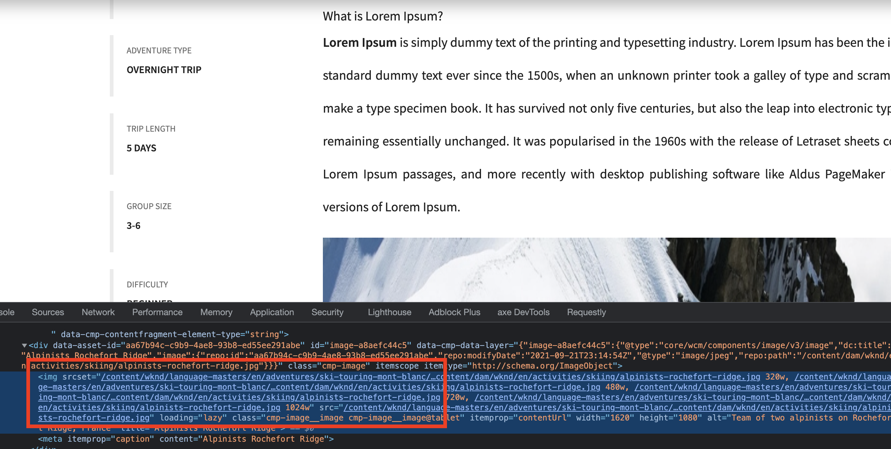

# ImageContentFragment

Check out the code and you should be able to get the working code of Content fragment with OOTB Image component support

you can also learn more about how to use these files and more explanation from the following blog: https://kirantech58867409.wordpress.com/2021/11/12/aem-content-fragment-with-image-support/
